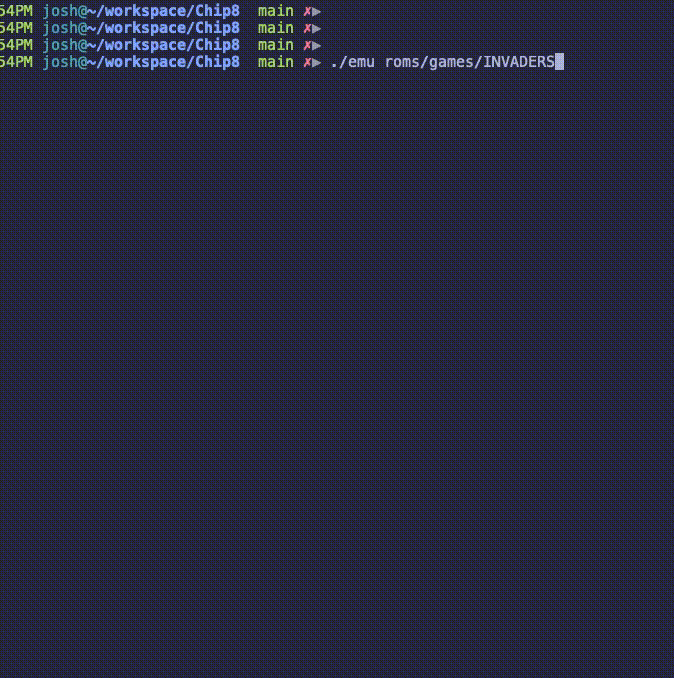
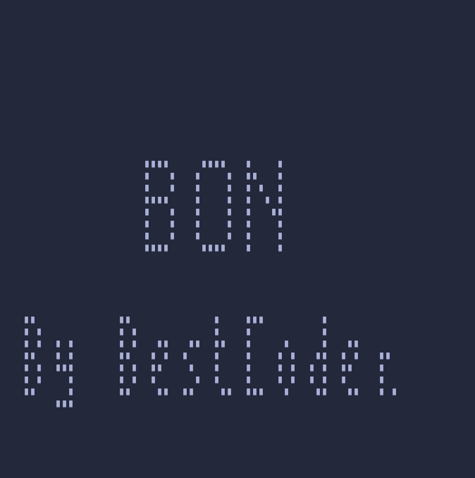
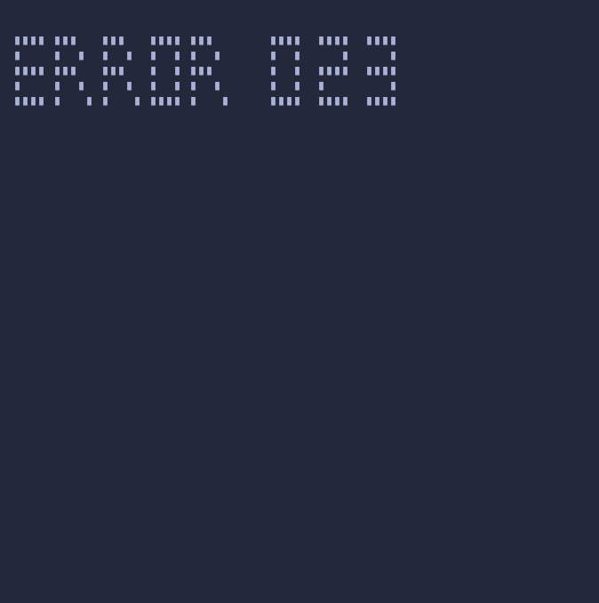

# CHIP-8 Emulator

 A CHIP-8 Emulator written in C++ with ncurses graphics.


## Compilation

The emulator requires only C++17 (with boost).

The program can be compiled using the Makefile or from the command-line with the command:
```bash
clang++ -std=c++17 -lncurses main.cpp -o emu
```

## Running the Emulator
To run the emulator, execute the emu binary with the Ch8 file as argument
```bash
>>./emu <ch8 file>
```
The test and game roms (located in the roms directory) are from [@daniel1515's AC8E repo](https://github.com/daniel5151/AC8E/tree/master/roms)


## Testing

The roms directory contains 2 test binaries (SCTEST and bc_test.ch8).


### bc_test.ch8
bc_test passes:




### SCTEST
The SCTEST tests that do not pass are for a specific Commodore implementation


 


## License
[MIT](https://choosealicense.com/licenses/mit/)
